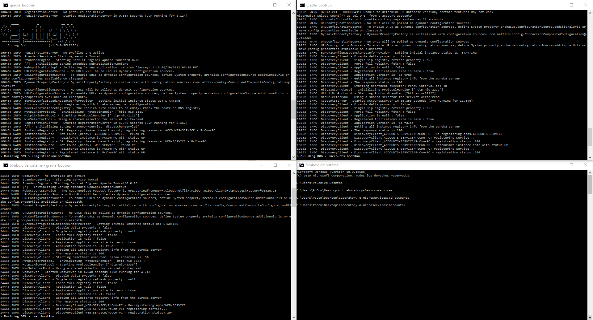
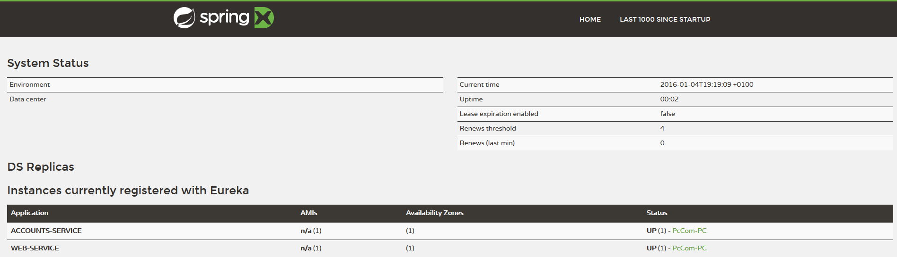
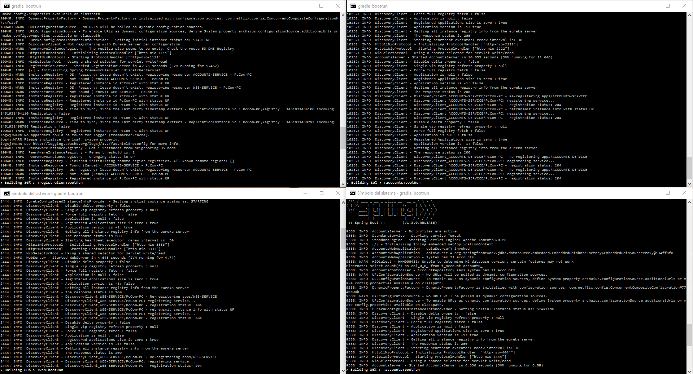

# Web Engineering 2015-2016 / Microservices
Please, go to the [Wiki](https://github.com/UNIZAR-30246-WebEngineering/Laboratory-6-microservices/wiki) in order to get the instructions for this assignment.

## 1st - The two microservices are running and registered

## 2nd - The service registration service has the two microservices registered

## 3rd - A second account microservice is running in the port 4444 and it is registered

## 4th - A brief report describing what happens when you kill the microservice with port 2222. Can the web service provide information about the accounts? Why?
There were two account services running (listening on ports 2222 and 4444), so when one of them is unavailable, the service register is able to "swap" it to the other one. Hence, what happened is that the web service asked the service register for a new accounts service because the one which it was communicating with is now down. At this moment, the service register is able to provide another accounts service to the web service (the one which is listening on the port 4444).
